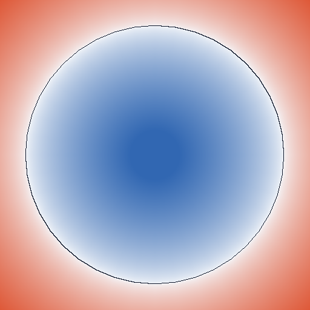
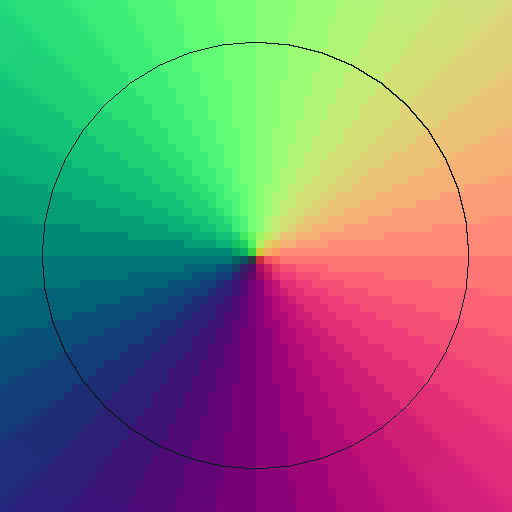
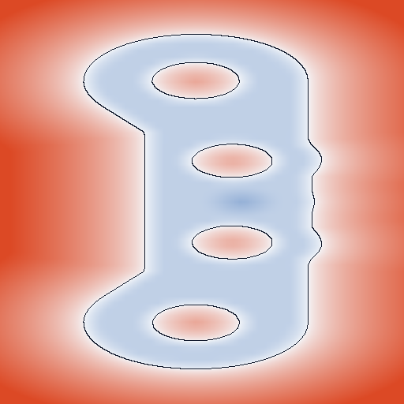
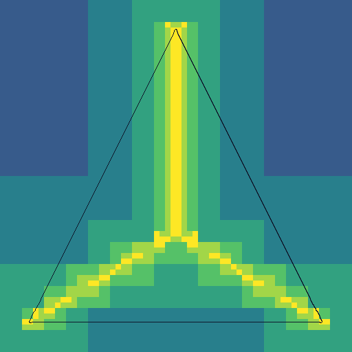
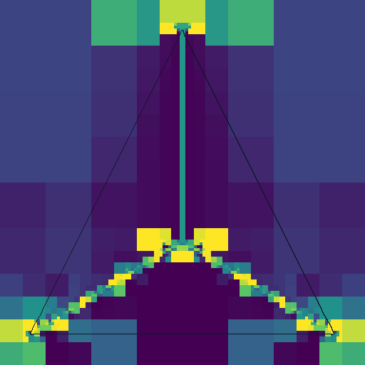
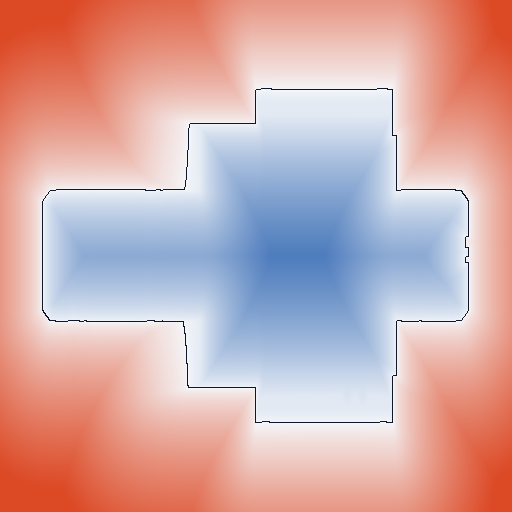

# NexDynSdf

NexDynSdf is a standalone signed-distance-field generator and read-only query
library. It is intentionally independent from NexDyn contact and solver code.
NexDyn can consume generated `.nsdf` assets through the stable C API or the
same-toolchain C++ wrapper. The C ABI is the integration boundary intended for
long-lived runtime compatibility.

## Reproducible results

The images below are generated from the canonical model catalog by
`scripts/generate_readme_images.ps1`. They are sampled through the same
`Asset::query_batch` path used by consumers; no private file-layout reader or
GPU shader reimplements the SDF query.

| Gradient Taylor distance/sign | Gradient Taylor unit normal |
|---|---|
|  |  |

The PyCoCoFastSDF sphere is baked to a `64^3` dense Gradient Taylor field. In
the distance view, blue is negative (inside), red is positive (outside), and
the dark line is the sampled zero crossing. The normal view maps normalized
`x/y/z` gradient components to RGB.



The migrated pressure-lubricated cam is baked from all `7,356` triangles to a
`64^3` dense trilinear field. This x-normal slice verifies the closed cam OBJ
through the same production generation and query path used by consumers.

| Adaptive tricubic leaf depth | Adaptive 19-probe measured error |
|---|---|
|  |  |

The NSM cone fixture retains its per-corner normals. These diagnostic slices
show where the adaptive tricubic tree refines and the per-leaf maximum error
measured at its 19 independent probes. The latter is not a certified
whole-cell bound.



The SdfLib Gear fixture is evaluated by the exact conservative
triangle-influence octree (`6,882` source triangles). See
[`docs/visualization.md`](docs/visualization.md) for the reference-module
review, rendering semantics, exact generation settings, and limitations.

Implemented representations and reconstructions:

- exact conservative triangle-influence octree;
- adaptive piecewise octree;
- dense regular grid;
- trilinear scalar reconstruction;
- tricubic Hermite scalar reconstruction;
- PyCoCo-compatible cell-centred gradient Taylor reconstruction.

Quantitative comparison is provided by `nexsdfvalidate`. Its versioned TSV
schema includes distance, gradient, normal, Eikonal, bidirectional sampled
surface error, serialized size, peak process memory, and warmed build/query
measurements with reproducibility metadata. See
[`docs/validation.md`](docs/validation.md) for the exact sampling policy and
the 32/64/128/256 matrix command.

The project accepts triangulated or polygonal OBJ files and NSM v1 binary mesh
files containing per-triangle face identifiers and per-corner normals.

## Algorithm references

The Gradient Taylor path follows the one-voxel first-order query used by the
Gradient-SDF paper and the reviewed PyCoCoFastSDF implementation:

1. C. Sommer, L. Sang, D. Schubert, and D. Cremers, “Gradient-SDF: A
   Semi-Implicit Surface Representation for 3D Reconstruction,” in
   *Proceedings of the IEEE/CVF Conference on Computer Vision and Pattern
   Recognition (CVPR)*, pp. 6270–6279, 2022.
   [doi:10.1109/CVPR52688.2022.00618](https://doi.org/10.1109/CVPR52688.2022.00618)
   ([open-access paper](https://openaccess.thecvf.com/content/CVPR2022/html/Sommer_Gradient-SDF_A_Semi-Implicit_Surface_Representation_for_3D_Reconstruction_CVPR_2022_paper.html)).

For a point `x`, NexDynSdf stores one value `phi_j` and unit gradient `g_j` at
the selected cell center `x_j`, then evaluates
`phi(x) = phi_j + dot(x - x_j, g_j)` and `grad(phi) = g_j`. This matches the
paper's first-order query in equations (14)–(15) and PyCoCoFastSDF's
`GradientSDFVolume.taylor_query`. NexDynSdf currently samples these tuples from
an exact triangle-mesh surface; it does not implement the paper's RGB-D fusion,
tracking, photometric bundle adjustment, or hashed sparse voxel system.

The exact and adaptive SdfLib-derived architecture is informed by these two
papers:

2. E. Pujol and A. Chica, “Triangle Influence Supersets for Fast Distance
   Computation,” *Computer Graphics Forum*, vol. 42, no. 6, article e14861,
   2023. [doi:10.1111/cgf.14861](https://doi.org/10.1111/cgf.14861).
3. E. Pujol and A. Chica, “Adaptive approximation of signed distance fields
   through piecewise continuous interpolation,” *Computers & Graphics*,
   vol. 114, pp. 337–346, 2023.
   [doi:10.1016/j.cag.2023.06.020](https://doi.org/10.1016/j.cag.2023.06.020).

The first SdfLib paper (reference 2) motivates the exact triangle-influence
representation. The current implementation uses a conservative AABB/Lipschitz
influence filter, not that paper's tighter convex-hull/GJK filter. The second
SdfLib paper (reference 3) motivates the adaptive trilinear/tricubic
representation and its probe-driven subdivision.
See [`docs/reference-provenance.md`](docs/reference-provenance.md) for the
paper-to-code boundary and implementation differences.

## Models

All example and validation models are consolidated under [`models/`](models/):

| Directory | Contents | Ownership |
|---|---|---|
| `models/pycoco/` | all 24 OBJ files from `obj_library` and `obj_model`, including the pressure-lubricated cam, gears, slideway, primitives, and compound bodies | repository owner's prior first-party work; no separate license file |
| `models/nagata/` | box, sphere, cone NSM, plus the cone ENG crease cache | repository owner's prior first-party work; no separate license file |
| `models/sdfmodel/` | generated cam, gear, coarse/fine validation NSM and cam STL | repository owner's prior first-party work; no separate license file |
| `models/sdflib/` | Gear OBJ | third-party SdfLib model; MIT license retained |

The catalog currently contains 34 assets: 32 OBJ/NSM parser inputs and two
auxiliary source/cache files. All 32 OBJ/NSM files parse successfully; 29 pass
the current strict single-component signed-distance topology policy. See
[`models/MANIFEST.md`](models/MANIFEST.md), the machine-readable
[`models/CATALOG.tsv`](models/CATALOG.tsv), and the current
[`models/AUDIT.tsv`](models/AUDIT.tsv). The only model-specific third-party
license is [`models/licenses/SdfLib-LICENSE.txt`](models/licenses/SdfLib-LICENSE.txt).

Cam assets are available directly at:

- `models/pycoco/obj_model/complex_geometry/PressureLubricatedCam.obj`: closed
  single-component OBJ and ready for SDF generation;
- `models/sdfmodel/cam.nsm`: retained experimental NSM with known
  boundary/non-manifold topology;
- `models/sdfmodel/cam.stl`: retained generated STL source output; STL import
  is not currently part of NexDynSdf.

## Build

```powershell
cmake -S . -B build -DNEXSDF_BUILD_TESTS=ON
cmake --build build --config Release
ctest --test-dir build -C Release -L unit --output-on-failure
ctest --test-dir build -C Release -L regression --output-on-failure
```

The canonical PowerShell entry point builds and runs the labeled suites:

```powershell
scripts/run_tests.ps1 -Configuration Release
scripts/run_tests.ps1 -Configuration Release -Shared
scripts/verify_install.ps1 -Configuration Release
scripts/run_validation_matrix.ps1 -Profile Smoke -Configuration Release
```

## Generate and inspect

```powershell
build/Release/nexsdfgen.exe models/pycoco/obj_library/cube.obj out/cube.nsdf `
  --representation grid --reconstruction trilinear --resolution 48
build/Release/nexsdfinspect.exe out/cube.nsdf 2 0 0
```

Generate a headless diagnostic slice and convert it to PNG without third-party
Python packages:

```powershell
build/Release/nexsdfviz.exe out/cube.nsdf out/cube.ppm `
  --axis z --mode distance --resolution 512
python scripts/ppm_to_png.py out/cube.ppm out/cube.png

# Rebuild every committed README image from the model catalog.
scripts/generate_readme_images.ps1 -Configuration Release
```

`nexsdfviz` supports `distance`, `normal`, `gradient-error`, `depth`, and
`error` modes. It is an offline tool and is not part of the runtime ABI.

Audit the complete OBJ/NSM catalog through the production import and topology
code:

```powershell
build/Release/nexsdfmodelaudit.exe models --expect-files 32 --expect-ready 29
scripts/update_model_catalog.ps1  # verifies source hashes and rewrites CATALOG.tsv
scripts/update_model_audit.ps1    # rewrites AUDIT.tsv through production loaders
```

Valid representation/reconstruction pairs are:

| Representation | Reconstruction |
|---|---|
| `grid` | `trilinear`, `tricubic`, `gradient` |
| `exact-octree` | `exact` |
| `adaptive-octree` | `trilinear`, `tricubic` |

The adaptive `--tolerance` is the 19-point trapezoidal RMS termination
threshold. Query metadata separately exposes the maximum absolute error at
those 19 probes; this measurement is not a proven whole-cell error bound.

## Consume from NexDyn

As a subproject:

```cmake
add_subdirectory(path/to/NexDynSdf)
target_link_libraries(nexdyn_target PRIVATE NexSdf::Query)
```

Or after `cmake --install`:

```cmake
find_package(NexDynSdf 0.1 REQUIRED CONFIG)
target_link_libraries(nexdyn_target PRIVATE NexSdf::Query)
```

On Windows, static-library consumers must use the same MSVC runtime library.
For a stable cross-module boundary, build shared and use `nexsdf/c_api.h`.

## Sign and units

- world coordinates and signed distance are expressed in the input length unit;
- outside is positive and inside is negative;
- the raw gradient is the derivative of the selected reconstruction;
- the unit normal is returned separately and never overwrites the raw gradient.
- points outside the baked domain return an explicit out-of-domain status;
  extrapolation is not performed.

See `docs/architecture.md`, `docs/algorithms.md`, and
`docs/reference-provenance.md` for implementation boundaries and attribution.
The exact runtime contract and file layout are in `docs/runtime-api.md` and
`docs/asset-format.md`. Planned correctness, topology, format, performance, and
validation work is tracked separately in [`docs/roadmap.md`](docs/roadmap.md).
